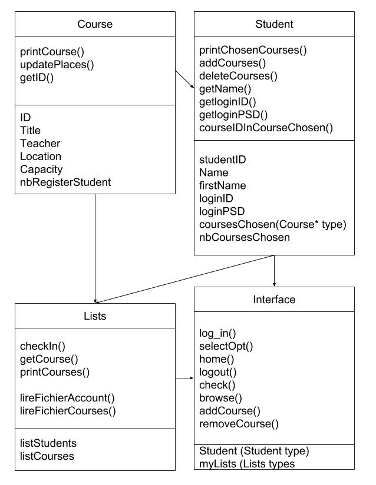

# UML TP : Course Selection System
###Pierre SEITE - Hugo SERIEYS

The objective of this TP is to design and implement a simplified course selection system.

## UML Diagrams

### Use-Cases Diagram
The use_cases diagram is very simple.
The only required step is to log in.
Then, you can :
* check your current planning,
* browse available courses,
* delete a selected course,
* add a new course,
* logout.


### Class diagram
The classes used for this application are detailed on the following diagram.
* Interface class
This class is used for every interaction with the user.
* Student
This class is used to have a common form for every student.
* Course
This class is used to have a common form for every course.
* Lists
This class is used to keep all the students and courses existing, based on the *account.txt* and *course.txt* files.


## C++ Source code

* Course.txt
```
Course_ID Title Teacher Location Capacity
CCMP2A-001 CPP PU S102 30
CCMP2A-002 Database OC S103 10
CCMP2A-003 Deep-Learning PM HS002 150
CCMP2A-004 Embedded-System MF Z005 31
CCMP2A-005 JAVA SC S101 15
CCMP2A-006 Microelectronics KT G201 30
CCMP2A-007 Network TT Z001 24
CCMP2A-008 Production-Management CY Amphi 110
CCMP2A-009 Robtics DD S103 30
CCMP2A-010 UML JB HS002 150
```

* Account.txt
```
Student_ID First_Name Last_Name Login_ID Login_PSD
S17001 Jean LeBleu jean.lebleu uelbelnaej
S17002 Marie Curry marie.curry yrruceiram
```

* main.cpp
``` cpp
#include <iostream>
#include <string>
using namespace std;

#include "interface.h"
#include "student.h"
#include "course.h"
#include "lists.h"

int main(){

  Lists L;
  Interface myInterface(&L);

  myInterface.log_in();
  myInterface.selectOpt();

  return 0;
}
```

* interface.h
``` cpp
#include <iostream>
using namespace std;

#pragma once

#include "student.h"
#include "lists.h"

class Interface{
public:

  Interface(Lists* lists){myLists = lists;}
  Student* log_in(); //function to log in the app
  int selectOpt(int opt = 0); //function to choose the adapted menu
  int home(int opt);  //function to show home menu
  void logout(); //function to logout
  int check(int opt); //function to show current planning
  int browse(int opt); //function to show available courses
  void addCourse(); //function to add a course to the planning
  void removeCourse(); //function to remove a course to the planning

private:
  Student* student;
  Lists* myLists;
};
```

* interface.cpp
``` cpp
#include <iostream>
#include <string>
using namespace std;

#include "interface.h"
#include "lists.h"

Student* Interface::log_in(){
  student = NULL;
  int compteur = 0;
  while(student == NULL){
    if (compteur>0){
      cout<<"\n****ERROR : Try again.****"<<endl;
    }
    cout<<"\nPlease enter your login and password.\n"<<endl;
    cout<<"login : ";
    string login;
    cin>>login;
    cout<<"password : ";
    string pwd;
    cin>>pwd;
    student = myLists->checkIn(login,pwd);
    compteur++;
  }
}

int Interface::selectOpt(int opt){
  switch (opt) {
    case 0: //home
      opt = home(opt);
      selectOpt(opt);

    case 1: //Logout
      logout();
      break;

    case 2: //available courses
      opt = browse(opt);
      selectOpt(opt);

    case 3: //current planning
      opt = check(opt);
      selectOpt(opt);

    default:
      selectOpt(opt);
  }
}

int Interface::home(int opt){
  cout<<"\n\n*****Welcome "<<student->getName()<<" !*****"<<endl;
  cout<<"\nChoose what you want to do :\n"<<endl;
  cout<<"1 : Logout"<<endl;
  cout<<"2 : Browse available courses"<<endl;
  cout<<"3 : Check my current planning"<<endl;
  cout<<"\n Select your action [1-3] : ";
  cin>>opt;
  return opt;
}

void Interface::logout(){
  cout<<"*****Goodbye "<<student->getName()<<" !*****"<<endl;
}

int Interface::check(int opt){
  cout<<"\n****Chosen courses : *****\n"<<endl;
  student->printChosenCourses();
  cout<<"\nChoose what you want to do :\n"<<endl;
  cout<<"0 : Go to home page"<<endl;
  cout<<"1 : Logout"<<endl;
  cout<<"2 : Add a new course"<<endl;
  cout<<"3 : Delete a selected course"<<endl;
  cout<<"\n Select your action [0-3] : ";
  cin>>opt;
  if (opt == 3){
    removeCourse();
  }
  return opt;
}

int Interface::browse(int opt){
  cout<<"\n*****Courses available :*****\n"<<endl;
  myLists->printCourses(student);
  cout<<"\nChoose what you want to do :\n"<<endl;
  cout<<"0 : Go to home page"<<endl;
  cout<<"1 : Logout"<<endl;
  cout<<"2 : Add a new course"<<endl;
  cout<<"\n Select your action [0-3] : ";
  cin>>opt;
  if (opt == 2){
    addCourse();
  }
  return opt;
}

void Interface::addCourse(){
  cout<<"Course to add [ID]: ";
  string id_course_add;
  cin>>id_course_add;

  Course * newCourse = myLists->getCourse(id_course_add);
  student->addCourses(newCourse);
}

void Interface::removeCourse(){
  cout<<"Course to delete [ID]: ";
  string id_course_del;
  cin>>id_course_del;
  student->removeCourses(id_course_del);
}
```

* course.h
``` cpp
#pragma once

using namespace std;

#include <string>
#include <iostream>

class Course{
public:
    Course(string ident="",string til="", int capa=0, string teach="", string loca=""){ID=ident;title=til;capacity=capa;teacher=teach;location=loca;nbRegisterStudent=0;}
    void printCourse()const;
    void updatePlaces();
    string getID(){return ID;}
private:
    string ID;
    string title;
    string teacher;
    string location;

    int capacity;
    int nbRegisterStudent;
};
```

* course.cpp
``` cpp
#include "course.h"


void Course::printCourse() const {
    cout<<"ID :"<<ID<<endl;
    cout<<"Title : "<< title<<endl;
    cout<<"Capacity : "<<capacity<<endl;
    cout<<"Teacher : "<<teacher<<endl;
    cout<<"Location : "<<location<<endl;
    cout<<"Student(s) registered : "<< nbRegisterStudent<<endl;
}

void Course::updatePlaces() {
    if (nbRegisterStudent < capacity) {
        nbRegisterStudent++;
    } else cout << "This course is full." << endl;
}
```

* student.h
``` cpp
#pragma once

using namespace std;

#include <string>
#include <iostream>

#include "course.h"

class Student{
public:
    Student( string stID="",string fNa="", string Na="",string logID="", string logPSD=""){studentID=stID;Name = Na; firstName=fNa; loginID=logID ;nbCoursesChosen=0; loginPSD=logPSD;}
    void printChosenCourses()const;
    void addCourses(Course* chosenCourse);
    void removeCourses(string IDtoRemove);
    string getName()const{return firstName;}
    string getloginID()const{return loginID;}
    string getloginPSD()const{return loginPSD;}
    bool courseIdInCourseChosen(string courseID);
private:
    string studentID;
    string Name;
    string firstName;
    string loginID;
    string loginPSD;
    Course *coursesChosen[4];
    int nbCoursesChosen;
};
```

* student.cpp
``` cpp
#include "student.h"


void Student::printChosenCourses() const {
    for(int i =0; i<nbCoursesChosen; i++){
        coursesChosen[i]->printCourse();
        cout<<endl;
    }
}

void Student::addCourses(Course* chosenCourse) {
    if(nbCoursesChosen<4){
        coursesChosen[nbCoursesChosen]=chosenCourse;
        nbCoursesChosen++;
    }
    else{
        cout<<"Error :  You already have 4 courses."<<endl;
        cout<<"You cannot register to more than 4 courses"<<endl;
    }
}

void Student::removeCourses(string IDtoRemove) {
    int indice = -1;
    for(int i=0; i<nbCoursesChosen; i++){
            if(coursesChosen[i]->getID()==IDtoRemove){
                indice = i;
            }
    }
    if(indice!=-1){
        for(int i=indice; i<nbCoursesChosen-1; i++){
            coursesChosen[i]=coursesChosen[i+1];
        }
        nbCoursesChosen--;
    }
}

bool Student::courseIdInCourseChosen(string courseID) {
    bool test = false;
    for( int i = 0 ; i<nbCoursesChosen ; i++ ){
        if(coursesChosen[i]->getID()==courseID){
            test=true;
        }
    }
    return test;
}
```

* lists.h
``` cpp
#pragma once

using namespace std;


#include <cstdlib>
#include <string>
#include <iostream>
#include <fstream>
#include <vector>
#include <iterator>
#include <map>
#include <algorithm>


#include "student.h"
#include "course.h"

class Lists{
public:
    Lists(){lireFichierAccount(); lireFichierCourses();}
    Student* checkIn(string login, string pswd);
    Course* getCourse(string courseID);
    void printCourses(Student* stdLogged);

private:
    void lireFichierAccount();
    void lireFichierCourses();

    vector<Student> listStudents;
    vector<Course> listCourses;
};
```

* lists.cpp
``` cpp
#include "lists.h"

void Lists::printCourses(Student* stdLogged) {
    vector<Course>::iterator it;
    for(it = listCourses.begin(); it!=listCourses.end(); it++){
      cout<<" "<<endl;
        if(stdLogged->courseIdInCourseChosen((it->getID())) ){
            cout<<"(Course already chosen)"<<endl;
        }
        it->printCourse();
    }
}

Student* Lists::checkIn(string login, string pswd) {
    Student *S=NULL;
    vector<Student>::iterator it;
    int indice=0;
    for(it = listStudents.begin(); it!=listStudents.end(); it++){

        if(it->getloginID()==login){
            if(it->getloginPSD()==pswd){
                S=&listStudents[indice];
            }
        }
        indice++;
    }
    return S;
}

Course* Lists::getCourse(string courseID){
  Course* wantedCourse = NULL;
  vector<Course>::iterator it;
  int indice = 0;
  for(it = listCourses.begin(); it!=listCourses.end(); it++){
    if (it->getID() == courseID){
      wantedCourse = &listCourses[indice];
    }
    indice++;
  }
  return wantedCourse;
}


void Lists::lireFichierAccount() {
    ifstream fichier("Account.txt");
    bool test = true;
    string studentID, Name, firstName, loginID, loginPSD;

    if (fichier) {
        fichier >> studentID >> firstName >> Name  >> loginID>>  loginPSD ;//reading title line (useless)
        //cout<<studentID<<" "<<firstName<<" " << Name<< " "<< loginID <<" "<<loginPSD<<endl;

        while (test) {
            fichier >> studentID >> firstName >> Name  >> loginID>>  loginPSD ;
            if (!fichier.eof()) {
                Student S(studentID, firstName, Name, loginID, loginPSD);
                listStudents.push_back(S);
            } else test = false;
        }
    } else {
        cout << "Account.txt file didn't opened correctly"<<endl;
    }
}


void Lists::lireFichierCourses() {
    ifstream fichier("Course.txt");
    bool test = true;
    string CourseID, Title, Teacher, Location, CapaciteF;
    int Capacite;

    if (fichier) {
        fichier >> CourseID >> Title >> Teacher >> Location >> CapaciteF;//reading title line (useless)
        //cout<<CourseID<<" "<<Title<<" " << Teacher<< " "<< Location <<" "<<loginPSD<<endl;

        while (test) {
            fichier >> CourseID >> Title >> Teacher >> Location >> Capacite;
            if (!fichier.eof()) {
                Course C(CourseID, Title, Capacite, Teacher, Location);
                listCourses.push_back(C);
            } else test = false;
        }
    } else {
        cout << "Course.txt file didn't opened correctly"<<endl;
    }
}
```
