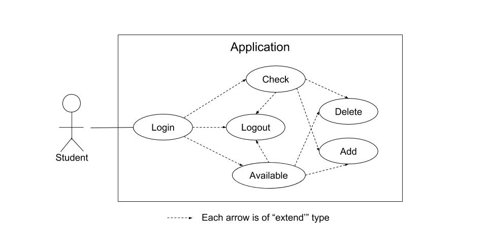

# UML TP : Course Selection System
###Pierre SEITE - Hugo SERIEYS

The objective of this TP is to design and implement a simplified course selection system.

## UML Diagrams

### Use-Cases Diagram
The use_cases diagram is very simple.
The only required step is to log in.
Then, you can :
* check your current planning,
* browse available courses,
* delete a selected course,
* add a new course,
* logout.


### Class diagram
The classes used for this application are detailed on the following diagram.
* Interface class
This class is used for every interaction with the user.
* Student
This class is used to have a common form for every student.
* Course
This class is used to have a common form for every course.
* Lists
This class is used to keep all the students and courses existing, based on the *account.txt* and *course.txt* files.

## C++ Source code
* main.cpp
```cpp

```

* interface.h
```cpp

```

* interface.cpp
```cpp

```

* course.h
```cpp

```

* course.cpp
```cpp

```

* student.h
```cpp

```

* student.cpp
```cpp

```

* lists.h
```cpp

```

* lists.cpp
```cpp

```
